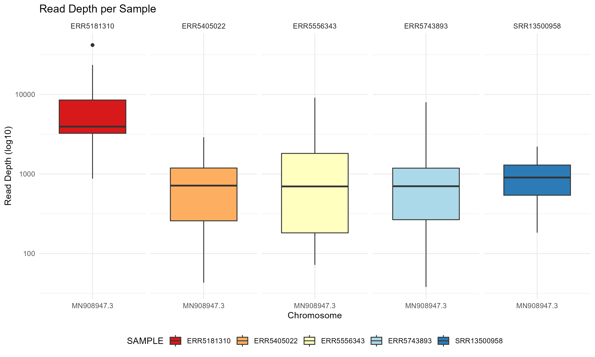
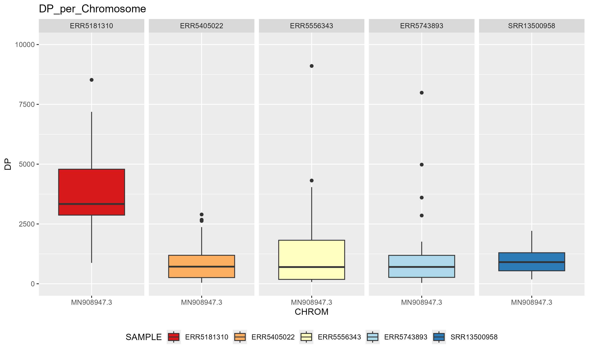

# Results

This directory contains the outputs and visualizations generated from the SARS-CoV-2 variant analysis workflow.

Large intermediate files such as BAM files, consensus FASTA files, VCF files, MultiQC HTML reports, and the Nextflow `work/` directory are not committed to the repository because they are large and can be reproduced using the workflow scripts.

## Key Outputs

After running the pipeline, the main generated outputs include:

- `results/viralrecon/variants/ivar/*.vcf.gz` — per-sample variant calls
- `results/viralrecon/variants/ivar/variants_long_table.csv` — merged variant table across all samples and input for downstream R analysis
- `results/viralrecon/multiqc/multiqc_report.html` — quality-control and pipeline summary report

## Summary of Analysis

A total of **153 variants** were identified across the five analyzed samples.

| Sample | Variants Called |
|---|---:|
| ERR5181310 | 33 |
| ERR5405022 | 36 |
| ERR5556343 | 35 |
| ERR5743893 | 28 |
| SRR13500958 | 21 |
| **Total** | **153** |

### Read Depth

Read depth (DP) across all 153 called variants:

| Statistic | Value |
|---|---:|
| Minimum | 38× |
| Mean | 2,635× |
| Maximum | 41,836× |

## Visualizations

The `plots/` directory contains read-depth visualizations generated using R and `ggplot2`.

### Read Depth per Sample — Log10 Scale



### Read Depth per Sample — Boxplot



### Additional Visualization

A violin plot is also available for detailed inspection of the read-depth distribution:

`plots/DP_per_Sample_violin.png`

## Reproducibility

The results can be regenerated using the scripts provided in the main repository:

```text
scripts/
├── 01_download_sra.sh
├── 02_run_fastqc.sh
├── 03_run_viralrecon.sh
└── 04_variant_analysis.R
